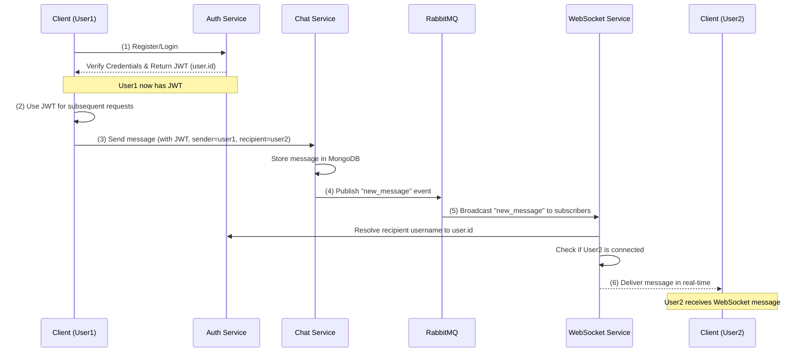

# Real-Time Chat System (Backend Services)

This project implements a real-time chat application’s backend stack using containerized microservices. 

The system uses:
- JWT-based authentication, 
- MongoDB for persistent storage, 
- RabbitMQ for message/event distribution, and 
- Separate services for authentication, messaging (Chat), and WebSocket-based communication.


## Architecture Overview

### Services

> #### Auth Service
> - Manages user registration and login.
> - Issues JWT tokens to authenticated users.
> 
> #### Chat Service
> - Stores and retrieves chat messages from the database.
> - Publishes `new_message` events to RabbitMQ when a message is sent.
> 
> #### WebSocket Service
> - Maintains authenticated WebSocket connections with clients.
> - Subscribes to `new_message` events from RabbitMQ to deliver messages in real time.
> - Resolves recipient usernames to user IDs via the Auth Service.
> 
> #### Database (MongoDB)
> - Stores user credentials (for Auth) and chat messages (for Chat).
> 
> #### RabbitMQ
> - Acts as a message queue for asynchronous event handling.
> - Chat Service publishes events; WebSocket Service consumes them.

### Architecture Diagram

```
┌────────────────────────────────────────────────────────┐
│                     Auth Service (Port 5001)           │
│  - /auth/register, /auth/login                         │
│  - Issues JWT tokens with user { id, username }        │
│  - Queries/Stores user data in MongoDB                 │
└───────────────┬────────────────────────────────────────┘
                │
                │  1. Validate/Store User Credentials
                ▼
┌────────────────────────────────────────────────────────┐
│               MongoDB (Container: db)                  │
│  - Stores two collections: Users & Messages            │
│  - Accessed internally by Auth & Chat services         │
└───────────────┬────────────────────────────────────────┘
                │
                │ 2. Chat Service reads/writes messages
                │
┌───────────────▼────────────────────────────────────────┐
│                  Chat Service (Port 5002)              │
│  - /chat/send, /chat/history                           │
│  - Persists messages in MongoDB                        │
│  - Publishes "new_message" events to RabbitMQ          │
└───────────────┬────────────────────────────────────────┘
                │
                │ 3. Publishes event to RabbitMQ
                ▼
┌────────────────────────────────────────────────────────┐
│  RabbitMQ (Container: rabbitmq, Ports 5672, 15672)     │
│  - "chat_exchange" (fanout exchange)                   │
│  - Receives "new_message" events from Chat Service     │
│  - Broadcasts events to subscribers (WebSocket Svc)    │
└───────────────┬────────────────────────────────────────┘
                │
                │ 4. WebSocket Svc subscribes
                ▼
┌────────────────────────────────────────────────────────┐
│          WebSocket Service (Port 5003)                 │
│  - ws://<host>:5003?token=<JWT>                        │
│  - Authenticates JWT on connection                     │
│  - Subscribes to "new_message" events from RabbitMQ    │
│  - Resolves recipient username -> userId via Auth Svc  │
│  - Delivers messages in real-time if recipient is online
└────────────────────────────────────────────────────────┘

```

### Specification of Micro-services

| Micro-service    | Responsibilities                                                                                                            | Key Feature                                        | Database Entities                                           | API Endpoints                                                                                   |
|------------------|-----------------------------------------------------------------------------------------------------------------------------|-----------------------------------------------------|------------------------------------------------------------|-------------------------------------------------------------------------------------------------|
| **Auth Service** | Manages user registration, login, and authentication. Validates user credentials against the database, issues JWT tokens for session management, and provides user lookup capabilities. | **JWT-based Authentication:** Ensures only verified users receive tokens to access protected APIs. | **Users:** Stores username, password (hashed), and related user data. | `POST /auth/register`: Create new user<br>`POST /auth/login`: Authenticate user and return JWT<br>`GET /auth/user-by-username`: Retrieve user ID from username |
| **Chat Service** | Handles message creation and retrieval. Persists chat messages in the database, fetches historical messages for users, and publishes "new_message" events to RabbitMQ for real-time distribution. | **Event-Driven Messaging:** Publishes events to RabbitMQ, decoupling message storage from delivery. | **Messages:** Documents containing sender, recipient (username), content, timestamp | `POST /chat/send`: Store a new message and publish event<br>`GET /chat/history`: Retrieve conversation history between two users |
| **WebSocket Service** | Maintains authenticated WebSocket connections using JWT verification. Subscribes to `new_message` events from RabbitMQ and delivers messages to connected clients in real-time. Uses Auth Service endpoints to resolve usernames to user IDs, ensuring consistent user identification. | **Real-Time Delivery:** Sends messages instantly to connected clients upon receiving events. | None (No direct DB access, relies on Auth and Chat) | WebSocket endpoint: `ws://<host>:5003?token=<JWT>` (No REST endpoints; connection and messaging via WebSocket protocol) |
| **Database (MongoDB)** | Serves as the primary data store for user credentials (via Auth) and chat messages (via Chat). Provides persistent, document-oriented storage that supports flexible schemas. | **Flexible NoSQL Storage:** Allows easy storage and retrieval of user and message documents. | **Users:** Contains user credentials and profile info<br>**Messages:** Stores chat conversations | No direct API endpoints (accessed internally by Auth and Chat services) |
| **RabbitMQ**     | Facilitates asynchronous communication between Chat and WebSocket services. Implements a fanout exchange where Chat publishes `new_message` events and WebSocket Service consumes them to deliver real-time updates. | **Scalable Messaging Queue:** Ensures reliable, decoupled event handling for real-time messaging. | N/A (Manages transient messages rather than persistent entities) | No direct HTTP endpoints (internal AMQP communication between services) |

### Workflow diagram



---

## Prerequisites

- **Docker & Docker Compose**: Ensure both are installed and running.
- **Postman** (recommended): To test endpoints and WebSockets.

## Getting Started

1. **Clone the Repository** (Assuming you have this project on your local machine):
   ```bash
   git clone https://github.com/Metsehafe-Eyasu/Distributed-Chat-Application
   cd Distributed-Chat-Application/
   ```

2. **Environment Variables**:  
   Each service has a `.env` file specifying configuration like `PORT`, `JWT_SECRET`, `DATABASE_URL`, and `RABBITMQ_URL`. Make sure these are correctly set.

3. **Build and Run Services**:
   ```bash
   docker-compose build
   docker-compose up
   ```
   Wait until all services have started. The logs should show:
   - Auth, Chat, WebSocket services running on their respective ports.
   - MongoDB and RabbitMQ initialized.
   - RabbitMQ management UI accessible at `http://localhost:15672`.

## Testing the Workflow with Postman

### Step 1: Register Users (Auth Service)
- **Request**:
  ```bash
  POST http://localhost:5001/auth/register
  Content-Type: application/json
  Body:
  {
    "username": "username1",
    "password": "password1"
  }
  ```
- Expected Response:
  ```json
  { "message": "User registered successfully" }
  ```

Register another user (`user2`) similarly.

### Step 2: Login to Get JWT
- **Request**:
  ```bash
  POST http://localhost:5001/auth/login
  Content-Type: application/json
  Body:
  {
    "username": "username1",
    "password": "password1"
  }
  ```
- Expected Response:
  ```json
  {
    "message": "Login successful",
    "token": "<JWT_TOKEN>"
  }
  ```
Save `<JWT_TOKEN>` for testing. Repeat for `user2`.

### Step 3: Connect via WebSocket (WebSocket Service)
In Postman:
- **New WebSocket Request**:
  `ws://localhost:5003?token=<JWT_TOKEN_for_user1>`

Click **Connect**. If successful, you should see `Connected`.

Do the same in another Postman tab for `user2`.

### Step 4: Send a Message (Chat Service)
Use `user1`'s token to send a message to `user2`:
- **Request**:
  ```bash
  POST http://localhost:5002/chat/send
  Authorization: Bearer <JWT_TOKEN_for_user1>
  Content-Type: application/json
  Body:
  {
    "sender": "user1",
    "recipient": "user2",
    "content": "Hello from user1!"
  }
  ```
- Expected Response:
  ```json
  {
    "message": "Message sent successfully",
    "data": {
      "sender": "user1",
      "recipient": "user2",
      "content": "Hello from user1!",
      "timestamp": "..."
    }
  }
  ```

Because `user2` is connected via WebSocket, the WebSocket Service will resolve `user2`’s username to their `id`, then send the message in real-time. The WebSocket tab for `user2` in Postman should display:
```json
{
  "sender": "user1",
  "content": "Hello from user1!",
  "timestamp": "..."
}
```

### Step 5: Fetch Message History (Chat Service)
To retrieve chat history between `user1` and `user2`:
- **Request**:
  ```bash
  GET http://localhost:5002/chat/history?user1=user1&user2=user2
  Authorization: Bearer <JWT_TOKEN_for_user2>
  ```
- Expected Response (Array of messages):
  ```json
  {
    "data": [
      {
        "sender": "user1",
        "recipient": "user2",
        "content": "Hello from user1!",
        "timestamp": "...",
        "_id": "..."
      }
    ]
  }
  ```
